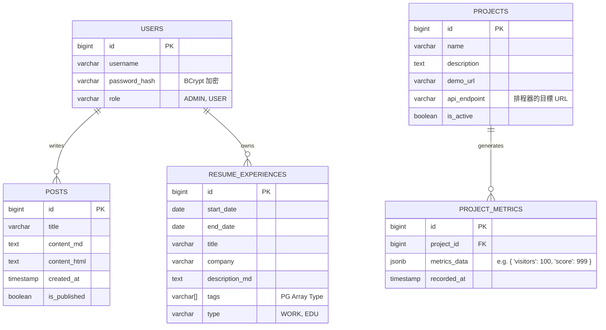

# 系統架構藍圖 (System Architecture Blueprint) - Daily Blog v2.0

這份藍圖詳細說明了針對面試與技術展示所設計的高階架構。
核心精神：**互動式履歷 (Interactive Resume)** + **技術數據儀表板 (Tech Dashboard)**。

## 1. 履歷呈現策略 (Resume Strategy)

不再是一張死板的 PDF，而是一個 **互動式時間軸 (Interactive Timeline)** 網頁應用。

### 呈現方式 (Frontend):
*   **技術選型**：使用 **Timeline.js** 或純 CSS/JS 手刻垂直時間軸。
*   **互動設計**：
    *   **預設狀態**：顯示年份、公司/學校名稱、職稱。
    *   **互動 (Hover/Click)**：卡片展開，顯示該時期的「關鍵技術棧 (Tech Stack)」與「具體貢獻 (Key Achievements)」。
    *   **過濾器**：上方設定按鈕 (例如: "Backend", "Frontend", "DevOps")，點擊後時間軸只亮起相關的經歷。

### 資料結構 (Data Model):
履歷資料不寫死在 HTML，而是存入資料庫，方便隨時更新與管理。
*   **資料表: `RESUME_EXPERIENCES`**
    *   `period_start`, `period_end` (時間區間)
    *   `company`, `title` (基本資訊)
    *   `description_md` (Markdown 格式的詳細說明)
    *   `tags` (用於過濾，如 "Java, Spring, SQL")
    *   `type` (Work: 工作 / Education: 學歷 / Project: 專案)

---

## 2. 作品集串接深度 (Portfolio Integration)

我們選擇 **方案 B：儀表板 (Dashboard)** 模式，而不只是單純的超連結。
這能向面試官證明你具備 **微服務 (Microservices)** 與 **API 串接** 的能力。

### 運作邏輯:
1.  **專案註冊**：在後台輸入你的 Side Project 資訊 (名稱、API URL)。
    *   範例：Retrograde Asteroid, URL: `https://game.dailycoding.com/api/stats`
2.  **排程更新 (Scheduler)**：
    *   主系統 (Daily Blog) 每小時執行一次 `@Scheduled` 任務。
    *   對所有註冊的 Side Projects 發送 HTTP GET 請求。
    *   獲取數據 (如：累積遊玩次數、最高分、目前在線人數)。
3.  **數據持久化**：將抓到的數據存入 `PROJECT_METRICS` 資料表。
4.  **前端展示**：
    *   在作品集卡片上，動態顯示這些數據（例如：即時加上 "🔥 熱門" 標籤，或顯示 "今日 50 人遊玩"）。
    *   這讓你的作品看起來是 **「活的」**。

---

## 3. 資料庫設計 (Database Schema)

目前架構明確採用 **PostgreSQL** 作為主要資料庫。

### 為什麼選 PostgreSQL?
1.  **JSON 支援**：Postgres 的 JSONB 格式非常適合儲存像「儀表板數據」這種結構不固定的資料 (Schema-less Data)。
2.  **高併發能力 (Concurrency)**：在未來高流量時 (例如你的遊戲爆紅)，Postgres 的讀寫效能優於 MySQL。

### 實體關聯圖 (ER Model):



## 4. 系統架構圖 (System Architecture)

```mermaid
graph TD
    User[訪客 / 面試官] -->|HTTPS| CF[Cloudflare]
    CF --> App[Daily Blog (Spring Boot)]
    
    subgraph "Backend Core (核心後端)"
        App -->|Auth| Security[Spring Security]
        App -->|Data| JPA[Spring Data JPA]
        App -->|Task| Scheduler[Spring Scheduler]
    end
    
    subgraph "Data Layer (資料層)"
        JPA <-->|Persist| PG[(PostgreSQL)]
        Scheduler -->|Save Metrics| PG
    end
    
    subgraph "External Ecosystem (外部生態系)"
        Scheduler -.->|Fetch Data| GameAPI[Asteroid Game API]
        Scheduler -.->|Fetch Stats| GitHub[GitHub API]
    end
```
